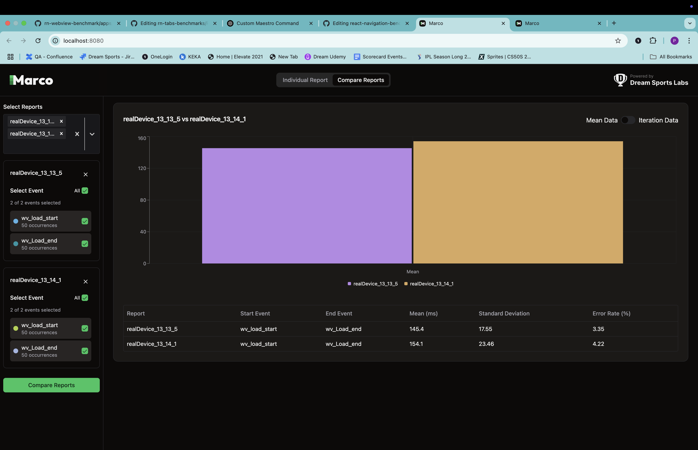
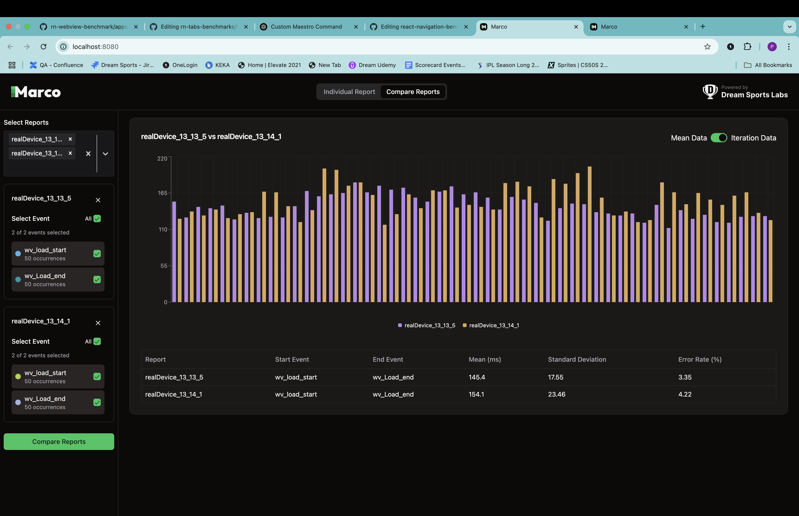
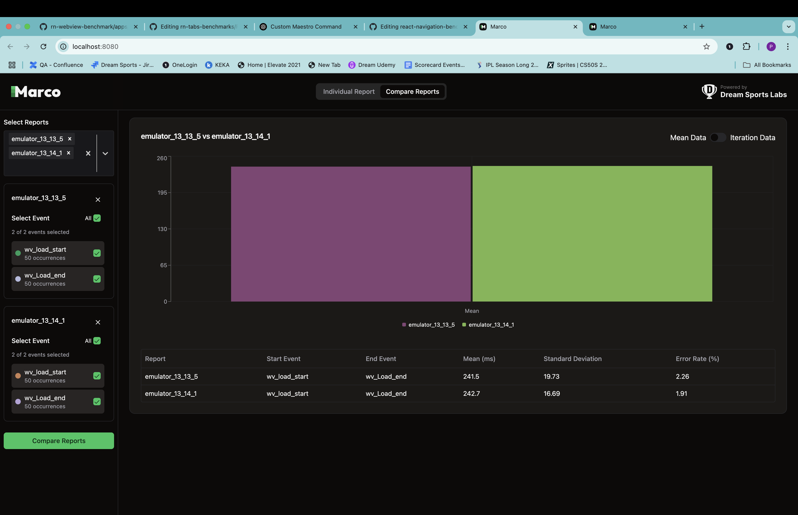
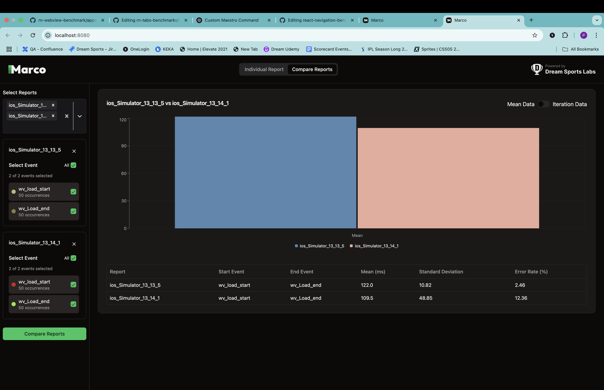

## 📊 React Native WebView Benchmark

#### This repo benchmarks [react-native-webview](https://github.com/react-native-webview/react-native-webview) performance across versions using [Marco](https://marco.dreamsportslabs.com).

## Benchmarking Metrics 📊
- **Load Time**: Time taken to load the webview on button press.

## About the Benchmarking Process 📝

We are using the [**Marco**](https://marco.dreamsportslabs.com/) tool to mark events and CLI tools provided by Marco to visualize the results.

<details>
<summary>📱 Device Details</summary>

These benchmarks were conducted on:

### 🤖 Android (Real Device)
- **Device:** Realme C35 (Low-end)
- **OS:** Android 13
- **RAM:** 4 GB

### 🍏 iOS (Simulator)
- **Device:** iPhone 16 Pro
- **OS Version:** iOS 18.3

</details>

## Load Time ⌛

1. **Capture the Initial Event:**
    - The event is triggered when a button is clicked on app.tsx. ([refer](https://github.com/dream-sports-labs/rn-webview-benchmark/blob/main/apps/webview_v_13_13_5/App.tsx))
    - The `timestamp` is extracted from the `Button.onPress` event object.
    - The `timestamp` and a marker name are passed to the native module `PerformanceTracker.track()` to log the start time.

2. **Track webview rendering:**
    - The load time completes when the initial webview content is fully painted and visible.
    - We wrapped the **webview** with the [**PerformanceTracker**](https://marco.dreamsportslabs.com/api/tracking-screen/) API from the **Marco** library.
    - This accurately captures the **onDraw** event, indicating when the screen is fully rendered.
    - Code [reference](https://github.com/dream-sports-labs/rn-webview-benchmark/blob/main/apps/webview_v_13_13_5/src/WebComponent.tsx)


## Results
### WebView Load Time Comparison
| Platform | Device Type | v 13.13.5 | v 13.14.1   |
| -------- | ----------- |-----------|-------------|
| Android  | Real Device | 145.4     | 154.1       |
| Android  | Emulator    | 241.5     | 242.7       |
| iOS      | Simulator   | 122.0     | 109.5       |

### Marco reports for Vivo





<details ><summary>Click to android emulator Reports</summary>

</details>

<details ><summary>click to view ios simulator reports</summary>

</details>
## 📁 Project Structure

```
rn-webview-benchmark/
├── apps/                      # Individual RN apps per version
│   ├── webview_v_13_13_5/
│   └── webview_v_13_14_1/
├── marco-results/             # Collected benchmark outputs
│   ├── webview_v_13_13_5/
│   └── webview_v_13_14_1/
├── marco.config.js            # Marco config
├── package.json               # Dependencies (optional)
├── README.md
```

---

<details>
<summary>Setup Instructions </summary>

### Prerequisites

1. [React Native Environment Setup](https://reactnative.dev/docs/next/environment-setup)
2. [Maestro Setup](https://maestro.mobile.dev/)
    - To check if Maestro is installed on your system, run command:
   ```sh
   maestro --version
   ```
   
### 1. Clone & Install

```
git clone https://github.com/dream-sports-labs/rn-webview-benchmark
cd rn-webview-benchmark
yarn install
```
---

## 📦 Install Dependencies Per App

Each app is a standalone React Native app. Run the following for each:

```
cd apps/webview_v_13_13_5
yarn install
cd ios
pod install
cd ../..
```

Repeat for other app folders.

---

## 🚀 Run the App

### iOS

```
cd apps/webview_v_13_13_5
yarn ios
```

### Android

```
yarn android
```

---

## 🧪 Run Benchmark Test

Each app has its own test`maestro/AndroidScript/webview_test.yml`.

```
cd apps/webview_v_13_13_5
maestro test maestro/AndroidScript/webview_test.yml  # for Android
maestro test maestro/AndroidScript/webview_test.yml  # for iOS

```

---

## 📈 View Results
### Generate and Visualize Report

A configuration file, `marco.config.js`, contains default paths to store reports. We can configure them based on our needs.

```sh
yarn marco generate --platform android
```

```sh
yarn marco visualize --platform android
```

This will open up a dashboard where we can select events to analyse data.

```

Move or copy them to the root directory `marco-results/webview_v_13_13_5/` folder for comparison.

---

</details>
